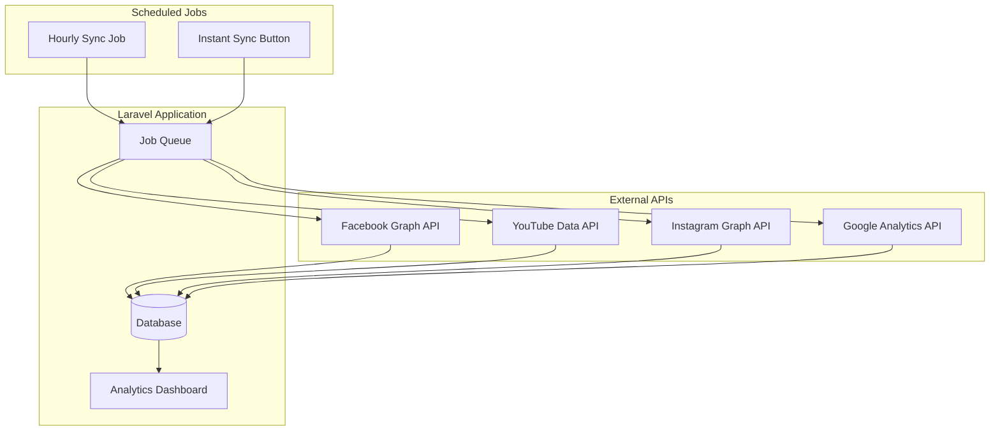

# Social Media Analytics Admin Panel - Product Requirements Document

## Document Information

| Field | Value |
|-------|-------|
| **Version** | 1.0.0 |
| **Last Updated** | December 22, 2025 |
| **Status** | Draft |
| **Author** | Development Team |

---

## Table of Contents

1. [Executive Summary](#1-executive-summary)
2. [Project Overview](#2-project-overview)
3. [Tech Stack](#3-tech-stack)
4. [Core Features](#4-core-features)
5. [System Architecture](#5-system-architecture)
6. [Database Schema](#6-database-schema)
7. [API Integrations](#7-api-integrations)
8. [User Interface Design](#8-user-interface-design)
9. [Dashboard Components](#9-dashboard-components)
10. [Additional Features](#10-additional-features)

---

## 1. Executive Summary

The Social Media Analytics Admin Panel is a comprehensive Laravel-based application designed to provide unified analytics across multiple social media platforms. The panel integrates with Facebook, YouTube, Instagram, and Google Analytics APIs to deliver real-time insights, engagement metrics, and performance analytics in a single, intuitive dashboard.

### Key Objectives

- **Centralized Analytics**: Aggregate data from multiple social platforms into one unified view
- **Multi-Account Support**: Enable users to manage multiple accounts per platform
- **Automated Data Sync**: Leverage Laravel's task scheduler for hourly data synchronization
- **Actionable Insights**: Provide meaningful metrics to inform content strategy decisions
- **Modern User Experience**: Deliver a responsive, intuitive interface with dark/light theme support

---

## 2. Project Overview

### 2.1 Problem Statement

Social media managers and marketers face the challenge of monitoring performance across multiple platforms. Each platform provides its own analytics interface, requiring users to navigate between different dashboards to compile a complete picture of their social media performance. This fragmented approach is:

- Time-consuming and inefficient
- Prone to data inconsistencies
- Difficult for generating comprehensive reports
- Lacking cross-platform comparison capabilities

### 2.2 Proposed Solution

A unified admin panel that:

- Connects to multiple social media platforms via OAuth
- Automatically syncs analytics data on a scheduled basis
- Presents aggregated metrics in intuitive visualizations
- Enables comparison of performance across platforms
- Supports export functionality for reporting needs

### 2.3 Target Users

| User Type | Description |
|-----------|-------------|
| Social Media Managers | Professionals managing multiple brand accounts |
| Marketing Teams | Teams needing consolidated performance reports |
| Content Creators | Individuals tracking engagement across platforms |
| Business Owners | Stakeholders requiring high-level performance overviews |

---

## 3. Tech Stack

### 3.1 Core Technologies

| Component | Technology | Version | Purpose |
|-----------|------------|---------|---------|
| Backend Framework | Laravel | 12.x | Application foundation, routing, ORM |
| Frontend Templating | Blade | - | Server-side rendering |
| Reactive UI | Alpine.js | 3.x | Client-side interactivity |
| CSS Framework | Tailwind CSS | 4.0 | Utility-first styling |
| Charts Library | Chart.js | 4.x | Data visualization |
| Authentication | hasinhayder/tyro-login | - | User authentication (existing) |
| Task Scheduling | Laravel Scheduler | - | Automated data sync |
| Queue System | Laravel Queues | - | Background job processing |
| Database | SQLite | - | Data persistence (can migrate to MySQL/PostgreSQL) |

### 3.2 External APIs

| Platform | API | Authentication |
|----------|-----|----------------|
| Facebook | Graph API v18.0 | OAuth 2.0 |
| YouTube | YouTube Data API v3 | OAuth 2.0 |
| Instagram | Instagram Graph API | OAuth 2.0 (via Facebook) |
| Google Analytics | Google Analytics Data API | OAuth 2.0 |

### 3.3 Development Tools

| Tool | Purpose |
|------|---------|
| Vite | Asset bundling and HMR |
| Composer | PHP dependency management |
| NPM | JavaScript dependency management |
| PHPUnit | Testing framework |

---

## 4. Core Features

### 4.1 Dashboard Overview

The main dashboard provides an aggregated view of metrics across all connected platforms.

#### 4.1.1 Key Metrics Display

- Total followers/subscribers across all platforms
- Total views (last 7/30/90 days)
- Total engagement (likes, comments, shares)
- Average engagement rate
- Content posted count

#### 4.1.2 Quick Stats Cards

```
┌─────────────────┬─────────────────┬─────────────────┬─────────────────┐
│   FACEBOOK      │   YOUTUBE       │   INSTAGRAM     │ GOOGLE ANALYTICS│
│   3 Pages       │   2 Channels    │   4 Accounts    │   2 Properties  │
│   Connected     │   Connected     │   Connected     │   Connected     │
│                 │                 │                 │                 │
│   12.5K Views   │   45.2K Views   │   8.3K Reach    │   25K Sessions  │
│   ↑ 12%         │   ↑ 8%          │   ↓ 3%          │   ↑ 15%         │
└─────────────────┴─────────────────┴─────────────────┴─────────────────┘
```

### 4.2 Multi-Account Support

Users can connect and manage multiple accounts per platform.

#### 4.2.1 Account Management Features

- Connect new accounts via OAuth flow
- Disconnect existing accounts
- View account-specific analytics
- Set primary/default account per platform
- Account status indicators (active, needs reauthorization, error)

#### 4.2.2 Account Limits

| Plan Type | Accounts per Platform | Total Accounts |
|-----------|----------------------|----------------|
| Free | 1 | 4 |
| Pro | 5 | 20 |
| Enterprise | Unlimited | Unlimited |

### 4.3 Platform-Specific Analytics Pages

Each platform has a dedicated analytics page with detailed metrics.

#### 4.3.1 Facebook Analytics

- Page insights (reach, engagement, page views)
- Post performance (individual post metrics)
- Video analytics
- Audience demographics
- Ad vs. Organic content split

#### 4.3.2 YouTube Analytics

- Channel overview (subscribers, total views, watch time)
- Video performance metrics
- Traffic sources
- Audience retention
- Revenue metrics (if monetized)

#### 4.3.3 Instagram Analytics

- Profile insights (followers, reach, impressions)
- Post and Reel performance
- Story analytics
- Hashtag performance
- Best posting times

#### 4.3.4 Google Analytics

- Website traffic overview
- User acquisition channels
- Page performance
- Conversion tracking
- Bounce rate and session duration

### 4.4 Integration Management

A dedicated section for managing platform connections.

#### 4.4.1 Navigation Structure

```
Integration
├── Facebook Pages
│   ├── Connected Pages List
│   ├── Add New Page
│   └── Page Settings
├── YouTube Channels
│   ├── Connected Channels List
│   ├── Add New Channel
│   └── Channel Settings
├── Instagram Business
│   ├── Connected Accounts List
│   ├── Add New Account
│   └── Account Settings
└── Google Analytics
    ├── Connected Properties List
    ├── Add New Property
    └── Property Settings
```

#### 4.4.2 OAuth Flow

```
User clicks "Connect Account"
        │
        ▼
Redirect to Platform OAuth
        │
        ▼
User authorizes permissions
        │
        ▼
Callback with auth code
        │
        ▼
Exchange code for tokens
        │
        ▼
Store tokens securely
        │
        ▼
Initial data sync triggered
        │
        ▼
Account ready for use
```

---

## 5. System Architecture

### 5.1 High-Level Architecture

```
┌─────────────────────────────────────────────────────────────────────────┐
│                           CLIENT LAYER                                   │
│  ┌──────────────────────────────────────────────────────────────────┐  │
│  │  Browser (Blade + Alpine.js + Tailwind CSS + Chart.js)           │  │
│  └──────────────────────────────────────────────────────────────────┘  │
└─────────────────────────────────────────────────────────────────────────┘
                                    │
                                    │ HTTPS
                                    ▼
┌─────────────────────────────────────────────────────────────────────────┐
│                        APPLICATION LAYER                                 │
│  ┌──────────────────────────────────────────────────────────────────┐  │
│  │                    Laravel 12 Application                         │  │
│  │  ┌────────────┐  ┌────────────┐  ┌────────────┐  ┌────────────┐  │  │
│  │  │ Controllers│  │  Services  │  │   Models   │  │    Jobs    │  │  │
│  │  └────────────┘  └────────────┘  └────────────┘  └────────────┘  │  │
│  │  ┌────────────┐  ┌────────────┐  ┌────────────┐  ┌────────────┐  │  │
│  │  │ Middleware │  │  Events    │  │ Listeners  │  │  Policies  │  │  │
│  │  └────────────┘  └────────────┘  └────────────┘  └────────────┘  │  │
│  └──────────────────────────────────────────────────────────────────┘  │
└─────────────────────────────────────────────────────────────────────────┘
                                    │
                    ┌───────────────┼───────────────┐
                    ▼               ▼               ▼
┌──────────────────────┐  ┌──────────────────┐  ┌──────────────────────┐
│     DATA LAYER       │  │   QUEUE LAYER    │  │   EXTERNAL APIS      │
│  ┌────────────────┐  │  │  ┌────────────┐  │  │  ┌────────────────┐  │
│  │    SQLite      │  │  │  │  Redis /   │  │  │  │ Facebook API   │  │
│  │   Database     │  │  │  │  Database  │  │  │  ├────────────────┤  │
│  └────────────────┘  │  │  │   Queue    │  │  │  │ YouTube API    │  │
│  ┌────────────────┐  │  │  └────────────┘  │  │  ├────────────────┤  │
│  │   File        │  │  │                  │  │  │ Instagram API  │  │
│  │   Storage     │  │  │                  │  │  ├────────────────┤  │
│  └────────────────┘  │  │                  │  │  │ Google API     │  │
└──────────────────────┘  └──────────────────┘  └──────────────────────┘
```

### 5.2 Data Flow Architecture



### 5.3 Directory Structure

```
app/
├── Console/
│   └── Commands/
│       ├── SyncFacebookAnalytics.php
│       ├── SyncYouTubeAnalytics.php
│       ├── SyncInstagramAnalytics.php
│       └── SyncGoogleAnalytics.php
├── Http/
│   ├── Controllers/
│   │   ├── DashboardController.php
│   │   ├── IntegrationController.php
│   │   ├── FacebookController.php
│   │   ├── YouTubeController.php
│   │   ├── InstagramController.php
│   │   ├── GoogleAnalyticsController.php
│   │   └── Auth/
│   │       └── OAuthController.php
│   └── Middleware/
│       └── EnsureAccountConnected.php
├── Jobs/
│   ├── SyncFacebookDataJob.php
│   ├── SyncYouTubeDataJob.php
│   ├── SyncInstagramDataJob.php
│   └── SyncGoogleAnalyticsDataJob.php
├── Models/
│   ├── User.php
│   ├── SocialAccount.php
│   ├── FacebookPage.php
│   ├── FacebookPost.php
│   ├── FacebookAnalytics.php
│   ├── YouTubeChannel.php
│   ├── YouTubeVideo.php
│   ├── YouTubeAnalytics.php
│   ├── InstagramAccount.php
│   ├── InstagramPost.php
│   ├── InstagramAnalytics.php
│   ├── GoogleAnalyticsProperty.php
│   ├── GoogleAnalyticsData.php
│   └── SyncLog.php
├── Services/
│   ├── FacebookService.php
│   ├── YouTubeService.php
│   ├── InstagramService.php
│   ├── GoogleAnalyticsService.php
│   └── AnalyticsAggregator.php
└── Events/
    ├── AccountConnected.php
    ├── AccountDisconnected.php
    └── DataSyncCompleted.php

resources/
├── views/
│   ├── layouts/
│   │   ├── app.blade.php
│   │   └── partials/
│   │       ├── sidebar.blade.php
│   │       ├── header.blade.php
│   │       └── footer.blade.php
│   ├── dashboard/
│   │   └── index.blade.php
│   ├── integrations/
│   │   ├── index.blade.php
│   │   ├── facebook/
│   │   ├── youtube/
│   │   ├── instagram/
│   │   └── google-analytics/
│   ├── analytics/
│   │   ├── facebook.blade.php
│   │   ├── youtube.blade.php
│   │   ├── instagram.blade.php
│   │   └── google-analytics.blade.php
│   └── components/
│       ├── cards/
│       ├── charts/
│       ├── tables/
│       └── modals/
├── css/
│   └── app.css
└── js/
    └── app.js

database/
└── migrations/
    ├── create_social_accounts_table.php
    ├── create_facebook_pages_table.php
    ├── create_facebook_posts_table.php
    ├── create_facebook_analytics_table.php
    ├── create_youtube_channels_table.php
    ├── create_youtube_videos_table.php
    ├── create_youtube_analytics_table.php
    ├── create_instagram_accounts_table.php
    ├── create_instagram_posts_table.php
    ├── create_instagram_analytics_table.php
    ├── create_google_analytics_properties_table.php
    ├── create_google_analytics_data_table.php
    └── create_sync_logs_table.php
```

---

## 6. Database Schema

### 6.1 Entity Relationship Diagram

```
┌──────────────────┐
│      users       │
├──────────────────┤
│ id               │───────────┐
│ name             │           │
│ email            │           │
│ password         │           │
│ created_at       │           │
│ updated_at       │           │
└──────────────────┘           │
                               │
          ┌────────────────────┼────────────────────┐
          │                    │                    │
          ▼                    ▼                    ▼
┌──────────────────┐  ┌──────────────────┐  ┌──────────────────┐
│ social_accounts  │  │   sync_logs      │  │  user_settings   │
├──────────────────┤  ├──────────────────┤  ├──────────────────┤
│ id               │  │ id               │  │ id               │
│ user_id (FK)     │  │ user_id (FK)     │  │ user_id (FK)     │
│ platform         │  │ platform         │  │ theme            │
│ platform_id      │  │ social_account_id│  │ notifications    │
│ access_token     │  │ status           │  │ timezone         │
│ refresh_token    │  │ records_synced   │  │ created_at       │
│ token_expires_at │  │ error_message    │  │ updated_at       │
│ account_name     │  │ started_at       │  └──────────────────┘
│ account_data     │  │ completed_at     │
│ status           │  │ created_at       │
│ created_at       │  └──────────────────┘
│ updated_at       │
└──────────────────┘
          │
          │ References specific platform tables
          ▼
┌──────────────────────────────────────────────────────────────────────┐
│                     PLATFORM-SPECIFIC TABLES                         │
└──────────────────────────────────────────────────────────────────────┘
```

### 6.2 Core Tables

#### 6.2.1 social_accounts

Stores OAuth credentials and account information for all connected platforms.

```sql
CREATE TABLE social_accounts (
    id BIGINT UNSIGNED PRIMARY KEY AUTO_INCREMENT,
    user_id BIGINT UNSIGNED NOT NULL,
    platform ENUM('facebook', 'youtube', 'instagram', 'google_analytics') NOT NULL,
    platform_user_id VARCHAR(255) NOT NULL,
    platform_account_id VARCHAR(255) NOT NULL,
    account_name VARCHAR(255) NOT NULL,
    account_type VARCHAR(50) NULL, -- page, channel, business, property
    access_token TEXT NOT NULL,
    refresh_token TEXT NULL,
    token_expires_at TIMESTAMP NULL,
    scopes TEXT NULL,
    account_data JSON NULL, -- Additional platform-specific data
    status ENUM('active', 'expired', 'error', 'disconnected') DEFAULT 'active',
    last_sync_at TIMESTAMP NULL,
    created_at TIMESTAMP DEFAULT CURRENT_TIMESTAMP,
    updated_at TIMESTAMP DEFAULT CURRENT_TIMESTAMP ON UPDATE CURRENT_TIMESTAMP,
    
    FOREIGN KEY (user_id) REFERENCES users(id) ON DELETE CASCADE,
    UNIQUE KEY unique_platform_account (user_id, platform, platform_account_id),
    INDEX idx_platform (platform),
    INDEX idx_status (status)
);
```

#### 6.2.2 sync_logs

Tracks all data synchronization operations.

```sql
CREATE TABLE sync_logs (
    id BIGINT UNSIGNED PRIMARY KEY AUTO_INCREMENT,
    user_id BIGINT UNSIGNED NOT NULL,
    social_account_id BIGINT UNSIGNED NOT NULL,
    platform VARCHAR(50) NOT NULL,
    sync_type ENUM('scheduled', 'manual', 'initial') NOT NULL,
    status ENUM('pending', 'running', 'completed', 'failed') DEFAULT 'pending',
    records_synced INT UNSIGNED DEFAULT 0,
    error_message TEXT NULL,
    error_code VARCHAR(50) NULL,
    started_at TIMESTAMP NULL,
    completed_at TIMESTAMP NULL,
    duration_seconds INT UNSIGNED NULL,
    metadata JSON NULL,
    created_at TIMESTAMP DEFAULT CURRENT_TIMESTAMP,
    
    FOREIGN KEY (user_id) REFERENCES users(id) ON DELETE CASCADE,
    FOREIGN KEY (social_account_id) REFERENCES social_accounts(id) ON DELETE CASCADE,
    INDEX idx_platform_status (platform, status),
    INDEX idx_created_at (created_at)
);
```

### 6.3 Facebook Tables

#### 6.3.1 facebook_pages

```sql
CREATE TABLE facebook_pages (
    id BIGINT UNSIGNED PRIMARY KEY AUTO_INCREMENT,
    social_account_id BIGINT UNSIGNED NOT NULL,
    page_id VARCHAR(255) NOT NULL,
    name VARCHAR(255) NOT NULL,
    username VARCHAR(255) NULL,
    category VARCHAR(255) NULL,
    followers_count INT UNSIGNED DEFAULT 0,
    likes_count INT UNSIGNED DEFAULT 0,
    profile_picture_url TEXT NULL,
    cover_photo_url TEXT NULL,
    website VARCHAR(500) NULL,
    about TEXT NULL,
    is_published BOOLEAN DEFAULT TRUE,
    created_at TIMESTAMP DEFAULT CURRENT_TIMESTAMP,
    updated_at TIMESTAMP DEFAULT CURRENT_TIMESTAMP ON UPDATE CURRENT_TIMESTAMP,
    
    FOREIGN KEY (social_account_id) REFERENCES social_accounts(id) ON DELETE CASCADE,
    UNIQUE KEY unique_page (social_account_id, page_id)
);
```

#### 6.3.2 facebook_posts

```sql
CREATE TABLE facebook_posts (
    id BIGINT UNSIGNED PRIMARY KEY AUTO_INCREMENT,
    facebook_page_id BIGINT UNSIGNED NOT NULL,
    post_id VARCHAR(255) NOT NULL,
    message TEXT NULL,
    story TEXT NULL,
    post_type ENUM('status', 'photo', 'video', 'link', 'share', 'event') NOT NULL,
    permalink_url TEXT NULL,
    full_picture TEXT NULL,
    is_ad BOOLEAN DEFAULT FALSE,
    is_published BOOLEAN DEFAULT TRUE,
    scheduled_publish_time TIMESTAMP NULL,
    published_at TIMESTAMP NULL,
    created_at TIMESTAMP DEFAULT CURRENT_TIMESTAMP,
    updated_at TIMESTAMP DEFAULT CURRENT_TIMESTAMP ON UPDATE CURRENT_TIMESTAMP,
    
    FOREIGN KEY (facebook_page_id) REFERENCES facebook_pages(id) ON DELETE CASCADE,
    UNIQUE KEY unique_post (facebook_page_id, post_id),
    INDEX idx_published_at (published_at),
    INDEX idx_is_ad (is_ad)
);
```

#### 6.3.3 facebook_analytics

```sql
CREATE TABLE facebook_analytics (
    id BIGINT UNSIGNED PRIMARY KEY AUTO_INCREMENT,
    facebook_page_id BIGINT UNSIGNED NOT NULL,
    facebook_post_id BIGINT UNSIGNED NULL, -- NULL for page-level analytics
    date DATE NOT NULL,
    metric_type ENUM('page', 'post') NOT NULL,
    impressions INT UNSIGNED DEFAULT 0,
    reach INT UNSIGNED DEFAULT 0,
    engaged_users INT UNSIGNED DEFAULT 0,
    reactions_total INT UNSIGNED DEFAULT 0,
    reactions_like INT UNSIGNED DEFAULT 0,
    reactions_love INT UNSIGNED DEFAULT 0,
    reactions_haha INT UNSIGNED DEFAULT 0,
    reactions_wow INT UNSIGNED DEFAULT 0,
    reactions_sad INT UNSIGNED DEFAULT 0,
    reactions_angry INT UNSIGNED DEFAULT 0,
    comments INT UNSIGNED DEFAULT 0,
    shares INT UNSIGNED DEFAULT 0,
    clicks INT UNSIGNED DEFAULT 0,
    video_views INT UNSIGNED DEFAULT 0,
    video_view_time INT UNSIGNED DEFAULT 0, -- seconds
    ctr DECIMAL(5,4) DEFAULT 0, -- Click-through rate
    engagement_rate DECIMAL(5,4) DEFAULT 0,
    negative_feedback INT UNSIGNED DEFAULT 0,
    created_at TIMESTAMP DEFAULT CURRENT_TIMESTAMP,
    updated_at TIMESTAMP DEFAULT CURRENT_TIMESTAMP ON UPDATE CURRENT_TIMESTAMP,
    
    FOREIGN KEY (facebook_page_id) REFERENCES facebook_pages(id) ON DELETE CASCADE,
    FOREIGN KEY (facebook_post_id) REFERENCES facebook_posts(id) ON DELETE CASCADE,
    UNIQUE KEY unique_analytics (facebook_page_id, facebook_post_id, date, metric_type),
    INDEX idx_date (date)
);
```

### 6.4 YouTube Tables

#### 6.4.1 youtube_channels

```sql
CREATE TABLE youtube_channels (
    id BIGINT UNSIGNED PRIMARY KEY AUTO_INCREMENT,
    social_account_id BIGINT UNSIGNED NOT NULL,
    channel_id VARCHAR(255) NOT NULL,
    title VARCHAR(255) NOT NULL,
    description TEXT NULL,
    custom_url VARCHAR(255) NULL,
    thumbnail_url TEXT NULL,
    banner_url TEXT NULL,
    country VARCHAR(10) NULL,
    subscriber_count BIGINT UNSIGNED DEFAULT 0,
    video_count INT UNSIGNED DEFAULT 0,
    view_count BIGINT UNSIGNED DEFAULT 0,
    is_monetized BOOLEAN DEFAULT FALSE,
    published_at TIMESTAMP NULL,
    created_at TIMESTAMP DEFAULT CURRENT_TIMESTAMP,
    updated_at TIMESTAMP DEFAULT CURRENT_TIMESTAMP ON UPDATE CURRENT_TIMESTAMP,
    
    FOREIGN KEY (social_account_id) REFERENCES social_accounts(id) ON DELETE CASCADE,
    UNIQUE KEY unique_channel (social_account_id, channel_id)
);
```

#### 6.4.2 youtube_videos

```sql
CREATE TABLE youtube_videos (
    id BIGINT UNSIGNED PRIMARY KEY AUTO_INCREMENT,
    youtube_channel_id BIGINT UNSIGNED NOT NULL,
    video_id VARCHAR(255) NOT NULL,
    title VARCHAR(500) NOT NULL,
    description TEXT NULL,
    thumbnail_url TEXT NULL,
    duration VARCHAR(50) NULL, -- ISO 8601 duration
    duration_seconds INT UNSIGNED DEFAULT 0,
    category_id VARCHAR(50) NULL,
    tags JSON NULL,
    privacy_status ENUM('public', 'private', 'unlisted') DEFAULT 'public',
    is_live_content BOOLEAN DEFAULT FALSE,
    is_short BOOLEAN DEFAULT FALSE,
    published_at TIMESTAMP NULL,
    created_at TIMESTAMP DEFAULT CURRENT_TIMESTAMP,
    updated_at TIMESTAMP DEFAULT CURRENT_TIMESTAMP ON UPDATE CURRENT_TIMESTAMP,
    
    FOREIGN KEY (youtube_channel_id) REFERENCES youtube_channels(id) ON DELETE CASCADE,
    UNIQUE KEY unique_video (youtube_channel_id, video_id),
    INDEX idx_published_at (published_at)
);
```

#### 6.4.3 youtube_analytics

```sql
CREATE TABLE youtube_analytics (
    id BIGINT UNSIGNED PRIMARY KEY AUTO_INCREMENT,
    youtube_channel_id BIGINT UNSIGNED NOT NULL,
    youtube_video_id BIGINT UNSIGNED NULL, -- NULL for channel-level analytics
    date DATE NOT NULL,
    metric_type ENUM('channel', 'video') NOT NULL,
    views BIGINT UNSIGNED DEFAULT 0,
    watch_time_minutes BIGINT UNSIGNED DEFAULT 0,
    average_view_duration DECIMAL(10,2) DEFAULT 0, -- seconds
    average_view_percentage DECIMAL(5,2) DEFAULT 0,
    subscribers_gained INT DEFAULT 0,
    subscribers_lost INT UNSIGNED DEFAULT 0,
    likes INT UNSIGNED DEFAULT 0,
    dislikes INT UNSIGNED DEFAULT 0,
    comments INT UNSIGNED DEFAULT 0,
    shares INT UNSIGNED DEFAULT 0,
    estimated_revenue DECIMAL(10,2) DEFAULT 0, -- USD
    impressions BIGINT UNSIGNED DEFAULT 0,
    impressions_ctr DECIMAL(5,4) DEFAULT 0,
    unique_viewers BIGINT UNSIGNED DEFAULT 0,
    traffic_source_data JSON NULL,
    device_type_data JSON NULL,
    geography_data JSON NULL,
    created_at TIMESTAMP DEFAULT CURRENT_TIMESTAMP,
    updated_at TIMESTAMP DEFAULT CURRENT_TIMESTAMP ON UPDATE CURRENT_TIMESTAMP,
    
    FOREIGN KEY (youtube_channel_id) REFERENCES youtube_channels(id) ON DELETE CASCADE,
    FOREIGN KEY (youtube_video_id) REFERENCES youtube_videos(id) ON DELETE CASCADE,
    UNIQUE KEY unique_analytics (youtube_channel_id, youtube_video_id, date, metric_type),
    INDEX idx_date (date)
);
```

### 6.5 Instagram Tables

#### 6.5.1 instagram_accounts

```sql
CREATE TABLE instagram_accounts (
    id BIGINT UNSIGNED PRIMARY KEY AUTO_INCREMENT,
    social_account_id BIGINT UNSIGNED NOT NULL,
    instagram_id VARCHAR(255) NOT NULL,
    username VARCHAR(255) NOT NULL,
    name VARCHAR(255) NULL,
    biography TEXT NULL,
    profile_picture_url TEXT NULL,
    website VARCHAR(500) NULL,
    followers_count INT UNSIGNED DEFAULT 0,
    follows_count INT UNSIGNED DEFAULT 0,
    media_count INT UNSIGNED DEFAULT 0,
    account_type ENUM('business', 'creator') NOT NULL,
    created_at TIMESTAMP DEFAULT CURRENT_TIMESTAMP,
    updated_at TIMESTAMP DEFAULT CURRENT_TIMESTAMP ON UPDATE CURRENT_TIMESTAMP,
    
    FOREIGN KEY (social_account_id) REFERENCES social_accounts(id) ON DELETE CASCADE,
    UNIQUE KEY unique_account (social_account_id, instagram_id)
);
```

#### 6.5.2 instagram_posts

```sql
CREATE TABLE instagram_posts (
    id BIGINT UNSIGNED PRIMARY KEY AUTO_INCREMENT,
    instagram_account_id BIGINT UNSIGNED NOT NULL,
    media_id VARCHAR(255) NOT NULL,
    media_type ENUM('IMAGE', 'VIDEO', 'CAROUSEL_ALBUM', 'REELS', 'STORY') NOT NULL,
    media_url TEXT NULL,
    thumbnail_url TEXT NULL,
    permalink TEXT NULL,
    caption TEXT NULL,
    hashtags JSON NULL,
    location VARCHAR(255) NULL,
    is_story BOOLEAN DEFAULT FALSE,
    story_expires_at TIMESTAMP NULL,
    published_at TIMESTAMP NULL,
    created_at TIMESTAMP DEFAULT CURRENT_TIMESTAMP,
    updated_at TIMESTAMP DEFAULT CURRENT_TIMESTAMP ON UPDATE CURRENT_TIMESTAMP,
    
    FOREIGN KEY (instagram_account_id) REFERENCES instagram_accounts(id) ON DELETE CASCADE,
    UNIQUE KEY unique_media (instagram_account_id, media_id),
    INDEX idx_media_type (media_type),
    INDEX idx_published_at (published_at)
);
```

#### 6.5.3 instagram_analytics

```sql
CREATE TABLE instagram_analytics (
    id BIGINT UNSIGNED PRIMARY KEY AUTO_INCREMENT,
    instagram_account_id BIGINT UNSIGNED NOT NULL,
    instagram_post_id BIGINT UNSIGNED NULL, -- NULL for account-level analytics
    date DATE NOT NULL,
    metric_type ENUM('account', 'post', 'story', 'reel') NOT NULL,
    impressions INT UNSIGNED DEFAULT 0,
    reach INT UNSIGNED DEFAULT 0,
    profile_views INT UNSIGNED DEFAULT 0,
    website_clicks INT UNSIGNED DEFAULT 0,
    email_contacts INT UNSIGNED DEFAULT 0,
    phone_call_clicks INT UNSIGNED DEFAULT 0,
    followers_gained INT DEFAULT 0,
    likes INT UNSIGNED DEFAULT 0,
    comments INT UNSIGNED DEFAULT 0,
    saves INT UNSIGNED DEFAULT 0,
    shares INT UNSIGNED DEFAULT 0,
    video_views INT UNSIGNED DEFAULT 0,
    engagement_rate DECIMAL(5,4) DEFAULT 0,
    story_exits INT UNSIGNED DEFAULT 0,
    story_replies INT UNSIGNED DEFAULT 0,
    story_taps_forward INT UNSIGNED DEFAULT 0,
    story_taps_back INT UNSIGNED DEFAULT 0,
    audience_demographics JSON NULL, -- Age, gender, location
    created_at TIMESTAMP DEFAULT CURRENT_TIMESTAMP,
    updated_at TIMESTAMP DEFAULT CURRENT_TIMESTAMP ON UPDATE CURRENT_TIMESTAMP,
    
    FOREIGN KEY (instagram_account_id) REFERENCES instagram_accounts(id) ON DELETE CASCADE,
    FOREIGN KEY (instagram_post_id) REFERENCES instagram_posts(id) ON DELETE CASCADE,
    UNIQUE KEY unique_analytics (instagram_account_id, instagram_post_id, date, metric_type),
    INDEX idx_date (date)
);
```

### 6.6 Google Analytics Tables

#### 6.6.1 google_analytics_properties

```sql
CREATE TABLE google_analytics_properties (
    id BIGINT UNSIGNED PRIMARY KEY AUTO_INCREMENT,
    social_account_id BIGINT UNSIGNED NOT NULL,
    property_id VARCHAR(255) NOT NULL,
    property_name VARCHAR(255) NOT NULL,
    property_type ENUM('GA4') DEFAULT 'GA4',
    account_id VARCHAR(255) NOT NULL,
    account_name VARCHAR(255) NULL,
    currency_code VARCHAR(10) DEFAULT 'USD',
    time_zone VARCHAR(100) NULL,
    industry_category VARCHAR(100) NULL,
    service_level ENUM('STANDARD', 'PREMIUM') DEFAULT 'STANDARD',
    created_at TIMESTAMP DEFAULT CURRENT_TIMESTAMP,
    updated_at TIMESTAMP DEFAULT CURRENT_TIMESTAMP ON UPDATE CURRENT_TIMESTAMP,
    
    FOREIGN KEY (social_account_id) REFERENCES social_accounts(id) ON DELETE CASCADE,
    UNIQUE KEY unique_property (social_account_id, property_id)
);
```

#### 6.6.2 google_analytics_data

```sql
CREATE TABLE google_analytics_data (
    id BIGINT UNSIGNED PRIMARY KEY AUTO_INCREMENT,
    google_analytics_property_id BIGINT UNSIGNED NOT NULL,
    date DATE NOT NULL,
    dimension_type VARCHAR(50) NULL, -- page, source, medium, device, country, etc.
    dimension_value VARCHAR(500) NULL,
    sessions INT UNSIGNED DEFAULT 0,
    total_users INT UNSIGNED DEFAULT 0,
    new_users INT UNSIGNED DEFAULT 0,
    active_users INT UNSIGNED DEFAULT 0,
    pageviews INT UNSIGNED DEFAULT 0,
    screens_per_session DECIMAL(5,2) DEFAULT 0,
    average_session_duration DECIMAL(10,2) DEFAULT 0, -- seconds
    bounce_rate DECIMAL(5,4) DEFAULT 0,
    engagement_rate DECIMAL(5,4) DEFAULT 0,
    engaged_sessions INT UNSIGNED DEFAULT 0,
    events_count INT UNSIGNED DEFAULT 0,
    conversions INT UNSIGNED DEFAULT 0,
    total_revenue DECIMAL(12,2) DEFAULT 0,
    ecommerce_purchases INT UNSIGNED DEFAULT 0,
    created_at TIMESTAMP DEFAULT CURRENT_TIMESTAMP,
    updated_at TIMESTAMP DEFAULT CURRENT_TIMESTAMP ON UPDATE CURRENT_TIMESTAMP,
    
    FOREIGN KEY (google_analytics_property_id) REFERENCES google_analytics_properties(id) ON DELETE CASCADE,
    UNIQUE KEY unique_data (google_analytics_property_id, date, dimension_type, dimension_value(191)),
    INDEX idx_date (date)
);
```

---

## 7. API Integrations

### 7.1 Facebook Graph API

#### 7.1.1 Required Permissions

| Permission | Purpose |
|------------|---------|
| `pages_show_list` | Access list of pages user manages |
| `pages_read_engagement` | Read page engagement metrics |
| `pages_read_user_content` | Read content posted to the page |
| `read_insights` | Access page and post insights |
| `business_management` | Access business accounts |

#### 7.1.2 Key Endpoints

```
GET /{page-id}/insights
GET /{page-id}/posts
GET /{post-id}/insights
GET /{page-id}/feed
GET /me/accounts
```

#### 7.1.3 Rate Limits

- 200 calls per hour per user
- 4,800 calls per 24-hour period per app

### 7.2 YouTube Data API

#### 7.2.1 Required Scopes

| Scope | Purpose |
|-------|---------|
| `youtube.readonly` | View YouTube account |
| `yt-analytics.readonly` | View YouTube Analytics reports |
| `yt-analytics-monetary.readonly` | View monetary reports |

#### 7.2.2 Key Endpoints

```
GET /channels?mine=true
GET /channels?id={channelId}
GET /videos?id={videoId}
GET /playlistItems?playlistId={uploadsPlaylistId}
YouTube Analytics API:
POST /reports?ids=channel=={channelId}&metrics=...
```

#### 7.2.3 Quota Limits

- 10,000 units per day per project
- Different operations cost different units (e.g., search = 100 units)

### 7.3 Instagram Graph API

#### 7.3.1 Required Permissions

| Permission | Purpose |
|------------|---------|
| `instagram_basic` | Read Instagram profile info |
| `instagram_manage_insights` | Access Instagram insights |
| `pages_show_list` | Access Facebook Pages |
| `pages_read_engagement` | Read page engagement |

#### 7.3.2 Key Endpoints

```
GET /{ig-user-id}?fields=...
GET /{ig-user-id}/media
GET /{ig-media-id}/insights
GET /{ig-user-id}/insights
```

#### 7.3.3 Rate Limits

- Inherited from Facebook Platform limits
- 200 calls per hour per user

### 7.4 Google Analytics Data API

#### 7.4.1 Required Scopes

| Scope | Purpose |
|-------|---------|
| `analytics.readonly` | View Google Analytics data |

#### 7.4.2 Key Endpoints

```
GET /v1beta/properties/{propertyId}:runReport
GET /v1beta/properties/{propertyId}:runRealtimeReport
GET /v1beta/properties/{propertyId}:getMetadata
GET /v1beta/accountSummaries
```

#### 7.4.3 Quota Limits

- 10,000 requests per day per project
- 10 concurrent requests per property

---

## 8. User Interface Design

### 8.1 Design Principles

| Principle | Description |
|-----------|-------------|
| **Clarity** | Information hierarchy with clear visual distinctions |
| **Consistency** | Uniform patterns across all pages and components |
| **Responsiveness** | Fully functional on desktop, tablet, and mobile |
| **Accessibility** | WCAG 2.1 AA compliance |
| **Performance** | Fast loading with progressive enhancement |

### 8.2 Color Palette

#### Light Theme

```css
:root {
    --primary: #3b82f6;          /* Blue 500 */
    --primary-dark: #2563eb;      /* Blue 600 */
    --secondary: #6366f1;         /* Indigo 500 */
    --success: #22c55e;           /* Green 500 */
    --warning: #f59e0b;           /* Amber 500 */
    --danger: #ef4444;            /* Red 500 */
    --background: #ffffff;
    --surface: #f8fafc;           /* Slate 50 */
    --border: #e2e8f0;            /* Slate 200 */
    --text-primary: #1e293b;      /* Slate 800 */
    --text-secondary: #64748b;    /* Slate 500 */
}
```

#### Dark Theme

```css
:root.dark {
    --primary: #60a5fa;           /* Blue 400 */
    --primary-dark: #3b82f6;      /* Blue 500 */
    --secondary: #818cf8;         /* Indigo 400 */
    --success: #4ade80;           /* Green 400 */
    --warning: #fbbf24;           /* Amber 400 */
    --danger: #f87171;            /* Red 400 */
    --background: #0f172a;        /* Slate 900 */
    --surface: #1e293b;           /* Slate 800 */
    --border: #334155;            /* Slate 700 */
    --text-primary: #f1f5f9;      /* Slate 100 */
    --text-secondary: #94a3b8;    /* Slate 400 */
}
```

### 8.3 Platform Brand Colors

```css
:root {
    --facebook: #1877f2;
    --youtube: #ff0000;
    --instagram: #e4405f;
    --google: #4285f4;
}
```

### 8.4 Layout Structure

```
┌─────────────────────────────────────────────────────────────────────────┐
│                              HEADER                                      │
│  ┌─────────┐  ┌─────────────────────────────────────────────────────┐   │
│  │  Logo   │  │  Search                      │ Notifications │ User │   │
│  └─────────┘  └─────────────────────────────────────────────────────┘   │
├────────────────┬────────────────────────────────────────────────────────┤
│                │                                                         │
│   SIDEBAR      │                    MAIN CONTENT                        │
│                │                                                         │
│ ┌────────────┐ │  ┌─────────────────────────────────────────────────┐  │
│ │ Dashboard  │ │  │                                                 │  │
│ ├────────────┤ │  │          Page-specific content                  │  │
│ │ Analytics  │ │  │                                                 │  │
│ │  ├ Facebook│ │  │          Charts, tables, cards                  │  │
│ │  ├ YouTube │ │  │                                                 │  │
│ │  ├ Instagram│ │  │                                                 │  │
│ │  └ GA      │ │  │                                                 │  │
│ ├────────────┤ │  │                                                 │  │
│ │Integration │ │  │                                                 │  │
│ │  ├ Facebook│ │  │                                                 │  │
│ │  ├ YouTube │ │  │                                                 │  │
│ │  ├ Instagram│ │  │                                                 │  │
│ │  └ GA      │ │  │                                                 │  │
│ ├────────────┤ │  │                                                 │  │
│ │ Settings   │ │  │                                                 │  │
│ └────────────┘ │  └─────────────────────────────────────────────────┘  │
│                │                                                         │
└────────────────┴────────────────────────────────────────────────────────┘
```

### 8.5 Component Library

#### 8.5.1 Stat Cards

```html
<div class="bg-white dark:bg-slate-800 rounded-xl shadow-sm border border-slate-200 dark:border-slate-700 p-6">
    <div class="flex items-center justify-between">
        <div>
            <p class="text-sm font-medium text-slate-500 dark:text-slate-400">Total Views</p>
            <p class="text-2xl font-bold text-slate-900 dark:text-white">124,563</p>
            <div class="flex items-center mt-1 text-sm">
                <span class="text-green-500">↑ 12.5%</span>
                <span class="text-slate-400 ml-1">vs last period</span>
            </div>
        </div>
        <div class="p-3 bg-blue-100 dark:bg-blue-900/30 rounded-lg">
            <svg class="w-6 h-6 text-blue-600 dark:text-blue-400">...</svg>
        </div>
    </div>
</div>
```

#### 8.5.2 Platform Connection Card

```html
<div class="bg-white dark:bg-slate-800 rounded-xl shadow-sm border border-slate-200 dark:border-slate-700 p-6">
    <div class="flex items-center gap-4">
        <div class="w-12 h-12 rounded-lg bg-[#1877f2] flex items-center justify-center">
            <!-- Platform Icon -->
        </div>
        <div class="flex-1">
            <h3 class="font-semibold text-slate-900 dark:text-white">Facebook Pages</h3>
            <p class="text-sm text-slate-500">3 pages connected</p>
        </div>
        <button class="btn-primary">Manage</button>
    </div>
</div>
```

---

## 9. Dashboard Components

### 9.1 Main Dashboard Overview

| Component | Description | Data Source |
|-----------|-------------|-------------|
| Platform Account Cards | Count of connected accounts per platform | `social_accounts` |
| Monthly Views Bar Chart | Stacked/grouped chart by platform | All `*_analytics` tables |
| Daily Views Line Chart | Trend analysis over selected period | All `*_analytics` tables |
| Engagement Metrics | CTR, likes, shares, comments | All `*_analytics` tables |
| Top Performing Posts | Ranked by engagement score | All `*_posts` tables |
| Ad vs Organic Split | Identify promotional content | `facebook_posts.is_ad` |
| Recent Activity Feed | Latest syncs, errors, updates | `sync_logs` |

### 9.2 Chart Configurations

#### 9.2.1 Monthly Views Bar Chart

```javascript
const monthlyViewsConfig = {
    type: 'bar',
    data: {
        labels: ['Jan', 'Feb', 'Mar', 'Apr', 'May', 'Jun'],
        datasets: [
            {
                label: 'Facebook',
                backgroundColor: '#1877f2',
                data: []
            },
            {
                label: 'YouTube',
                backgroundColor: '#ff0000',
                data: []
            },
            {
                label: 'Instagram',
                backgroundColor: '#e4405f',
                data: []
            },
            {
                label: 'Google Analytics',
                backgroundColor: '#4285f4',
                data: []
            }
        ]
    },
    options: {
        responsive: true,
        plugins: {
            legend: {
                position: 'bottom'
            }
        },
        scales: {
            x: {
                stacked: false
            },
            y: {
                beginAtZero: true,
                ticks: {
                    callback: (value) => formatNumber(value)
                }
            }
        }
    }
};
```

#### 9.2.2 Daily Views Line Chart

```javascript
const dailyViewsConfig = {
    type: 'line',
    data: {
        labels: [], // Last 30 days
        datasets: [
            {
                label: 'Total Views',
                borderColor: '#3b82f6',
                backgroundColor: 'rgba(59, 130, 246, 0.1)',
                fill: true,
                tension: 0.4,
                data: []
            }
        ]
    },
    options: {
        responsive: true,
        plugins: {
            legend: {
                display: false
            }
        },
        scales: {
            y: {
                beginAtZero: true
            }
        },
        interaction: {
            intersect: false,
            mode: 'index'
        }
    }
};
```

#### 9.2.3 Engagement Doughnut Chart

```javascript
const engagementConfig = {
    type: 'doughnut',
    data: {
        labels: ['Likes', 'Comments', 'Shares', 'Saves'],
        datasets: [{
            data: [],
            backgroundColor: [
                '#ef4444',
                '#3b82f6',
                '#22c55e',
                '#f59e0b'
            ]
        }]
    },
    options: {
        responsive: true,
        plugins: {
            legend: {
                position: 'right'
            }
        }
    }
};
```

### 9.3 Data Tables

#### 9.3.1 Top Posts Table

| Column | Description |
|--------|-------------|
| Platform | Icon indicating source platform |
| Content | Post preview (thumbnail + truncated text) |
| Published | Date/time published |
| Reach | Total reach/impressions |
| Engagement | Total interactions |
| Eng. Rate | Engagement rate percentage |
| Actions | View details, open original |

#### 9.3.2 Sync History Table

| Column | Description |
|--------|-------------|
| Platform | Social platform synced |
| Account | Specific account name |
| Type | Scheduled / Manual / Initial |
| Status | Badge (success, failed, running) |
| Records | Number of records synced |
| Duration | Time taken |
| Timestamp | When sync occurred |

---

## 10. Additional Features

### 10.1 Audience Demographics

#### 10.1.1 Age Distribution

- Visual breakdown of audience age groups
- Comparison across platforms
- Trend analysis over time

#### 10.1.2 Gender Distribution

- Pie/doughnut chart for gender breakdown
- Platform-specific comparisons

#### 10.1.3 Geographic Distribution

- World map visualization
- Top countries/cities table
- Regional performance metrics

### 10.2 Best Posting Time Analysis

#### 10.2.1 Engagement Heatmap

```
        Mon  Tue  Wed  Thu  Fri  Sat  Sun
00:00   ░░░  ░░░  ░░░  ░░░  ░░░  ▒▒▒  ▒▒▒
06:00   ▒▒▒  ▒▒▒  ▒▒▒  ▒▒▒  ▒▒▒  ▓▓▓  ▓▓▓
12:00   ▓▓▓  ▓▓▓  ▓▓▓  ▓▓▓  ███  ███  ███
18:00   ███  ███  ███  ███  ███  ▓▓▓  ▓▓▓
21:00   ▓▓▓  ▓▓▓  ▓▓▓  ▓▓▓  ▓▓▓  ▒▒▒  ▒▒▒
```

#### 10.2.2 Recommendations

- Best days to post per platform
- Optimal time windows
- Audience activity patterns

### 10.3 Content Performance Comparison

#### 10.3.1 Post Type Analysis

| Content Type | Avg. Reach | Avg. Engagement | Engagement Rate |
|--------------|------------|-----------------|-----------------|
| Images | 5,234 | 423 | 8.1% |
| Videos | 12,456 | 1,234 | 9.9% |
| Reels/Shorts | 45,678 | 5,678 | 12.4% |
| Text Only | 2,345 | 156 | 6.7% |
| Carousels | 8,765 | 876 | 10.0% |

#### 10.3.2 Hashtag Performance

- Top performing hashtags
- Reach per hashtag
- Hashtag combinations analysis

### 10.4 Export Reports

#### 10.4.1 Supported Formats

| Format | Use Case |
|--------|----------|
| PDF | Formal reports, presentations |
| CSV | Data analysis, spreadsheets |
| Excel | Detailed data manipulation |
| PNG/SVG | Individual chart exports |

#### 10.4.2 Report Templates

- Executive Summary (1-page overview)
- Detailed Analytics Report
- Platform-specific Reports
- Custom Date Range Reports
- Comparison Reports (period vs period)

### 10.5 Real-time Notifications

#### 10.5.1 Notification Types

| Type | Trigger | Priority |
|------|---------|----------|
| Viral Content Alert | Post reaches 10x avg. engagement | High |
| Token Expiration | OAuth token expires in 7 days | High |
| Sync Failure | API sync fails 3 consecutive times | High |
| Milestone Reached | Followers/subscribers milestone | Medium |
| Weekly Summary | End of week report ready | Low |
| Trend Alert | Significant change in metrics | Medium |

#### 10.5.2 Notification Channels

- In-app notifications (bell icon)
- Email digests (configurable frequency)
- Browser push notifications (optional)

### 10.6 Theme System

#### 10.6.1 Theme Options

- **Light Mode**: Clean, professional appearance
- **Dark Mode**: Reduced eye strain, modern aesthetic
- **System**: Follows OS preference

#### 10.6.2 Implementation

```javascript
// Alpine.js theme toggle
Alpine.data('theme', () => ({
    dark: localStorage.getItem('theme') === 'dark' || 
          (!localStorage.getItem('theme') && 
           window.matchMedia('(prefers-color-scheme: dark)').matches),
    toggle() {
        this.dark = !this.dark;
        localStorage.setItem('theme', this.dark ? 'dark' : 'light');
        document.documentElement.classList.toggle('dark', this.dark);
    }
}));
```

---

## 11. Security Requirements

### 11.1 Authentication & Authorization

| Requirement | Implementation |
|-------------|----------------|
| User Authentication | hasinhayder/tyro-login (existing) |
| Session Management | Laravel session with secure cookies |
| Password Security | Bcrypt hashing, min 8 characters |
| 2FA Support | Optional TOTP-based 2FA |
| Role-based Access | Admin, Manager, Viewer roles |

### 11.2 Data Protection

| Requirement | Implementation |
|-------------|----------------|
| Token Encryption | AES-256 encryption for OAuth tokens |
| HTTPS | Enforce TLS 1.2+ for all connections |
| CSRF Protection | Laravel CSRF tokens on all forms |
| XSS Prevention | Blade auto-escaping, CSP headers |
| SQL Injection | Eloquent ORM parameterized queries |

### 11.3 API Security

| Requirement | Implementation |
|-------------|----------------|
| Rate Limiting | Laravel rate limiter middleware |
| Token Refresh | Automatic refresh before expiration |
| Scope Limitation | Request minimal required permissions |
| Audit Logging | Log all API access and data changes |

### 11.4 Compliance

| Standard | Requirements |
|----------|--------------|
| GDPR | Data export, deletion, consent management |
| CCPA | Privacy policy, opt-out mechanism |
| Platform Policies | Facebook, Google, Meta developer policies |

---


| Metric | Target |
|--------|--------|
| Time to Insights | < 5 minutes |
| Report Generation Time | < 30 seconds |
| User Satisfaction (NPS) | > 50 |
| Feature Adoption Rate | > 60% |

---

## Appendix A: API Response Examples

### A.1 Facebook Page Insights Response

```json
{
    "data": [
        {
            "name": "page_impressions",
            "period": "day",
            "values": [
                {
                    "value": 12345,
                    "end_time": "2025-12-22T08:00:00+0000"
                }
            ]
        }
    ]
}
```

### A.2 YouTube Analytics Response

```json
{
    "rows": [
        ["2025-12-22", "1234", "5678", "12.5", "45.3"]
    ],
    "columnHeaders": [
        {"name": "day", "columnType": "DIMENSION"},
        {"name": "views", "columnType": "METRIC"},
        {"name": "estimatedMinutesWatched", "columnType": "METRIC"},
        {"name": "averageViewPercentage", "columnType": "METRIC"},
        {"name": "subscribersGained", "columnType": "METRIC"}
    ]
}
```

---

## Appendix B: Environment Variables

```env
# Application
APP_NAME="Social Media Analytics"
APP_ENV=production
APP_DEBUG=false
APP_URL=https://analytics.example.com

# Database
DB_CONNECTION=sqlite
DB_DATABASE=/path/to/database.sqlite

# Queue
QUEUE_CONNECTION=database

# Facebook
FACEBOOK_CLIENT_ID=your_app_id
FACEBOOK_CLIENT_SECRET=your_app_secret
FACEBOOK_REDIRECT_URI=https://analytics.example.com/auth/facebook/callback

# YouTube / Google
GOOGLE_CLIENT_ID=your_client_id
GOOGLE_CLIENT_SECRET=your_client_secret
GOOGLE_REDIRECT_URI=https://analytics.example.com/auth/google/callback

# Encryption
OAUTH_TOKEN_ENCRYPTION_KEY=your_32_character_key
```

---

## Appendix C: Glossary

| Term | Definition |
|------|------------|
| CTR | Click-Through Rate - percentage of impressions resulting in clicks |
| Engagement Rate | (Total Interactions / Total Reach) × 100 |
| Impressions | Number of times content was displayed |
| Reach | Number of unique users who saw content |
| OAuth | Open Authorization - secure token-based authentication |
| Webhook | HTTP callback for real-time event notifications |
| Rate Limit | Maximum API calls allowed in a time period |

---

## Document History

| Version | Date | Author | Changes |
|---------|------|--------|---------|
| 1.0.0 | Dec 22, 2025 | Development Team | Initial PRD creation |

---

*End of Document*

